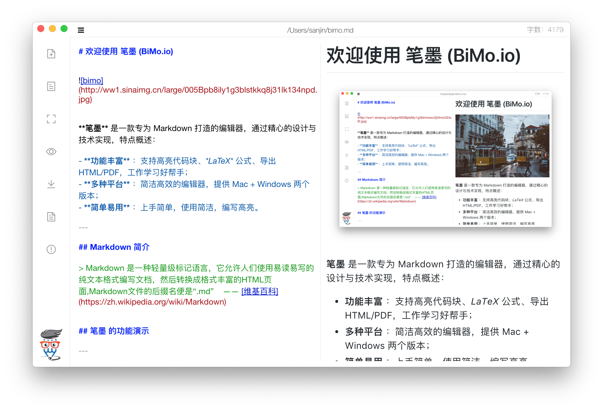

# 欢迎使用 笔墨 (BiMo.io)



**笔墨** 是一款专为 Markdown 打造的编辑器，通过精心的设计与技术实现，特点概述：
 
- **功能丰富** ：支持高亮代码块、*LaTeX* 公式、导出HTML/PDF，工作学习好帮手；
- **多种平台** ：简洁高效的编辑器，提供 Mac + Windows 两个版本；
- **简单易用** ：上手简单，使用简洁，编写高亮。

---

## 安装说明

``` bash
# 安装依赖模块
npm install 
OR 
yarn install

# 启动项目 
npm run dev 
OR 
yarn run dev

# 编译客户端
npm run build:darwin or linux or win32 or all
OR 
yarn run build:darwin or linux or win32 or all
```

## 快捷键

打开文档 <kbd>Cmd + O</kbd>

新建文档 <kbd>Cmd + N</kbd>

标题 <kbd>Cmd + 1-6</kbd>

粗体 <kbd>Cmd + B</kbd>

斜体 <kbd>Cmd + I</kbd>

链接 <kbd>Cmd + L</kbd>

图片 <kbd>Cmd + G</kbd>

代码块 <kbd>Cmd + K</kbd>

## 反馈与建议

- 邮箱：<service@c.team>
- Github：https://github.com/cteams/BiMo